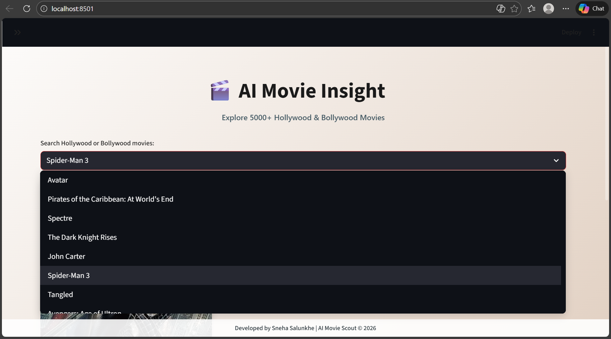
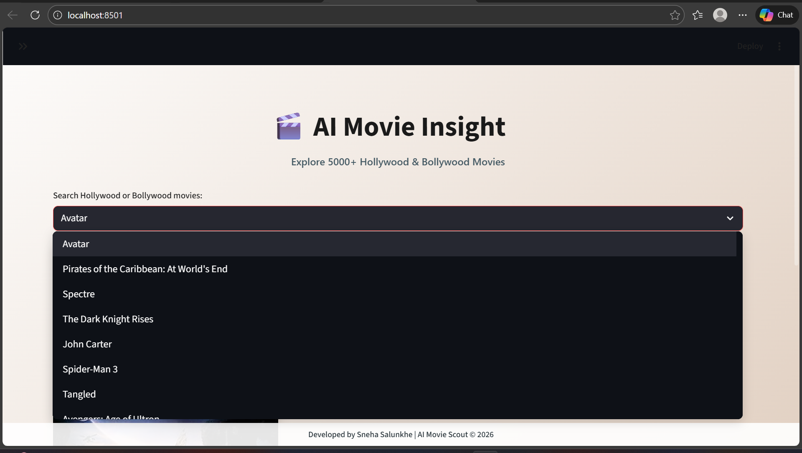
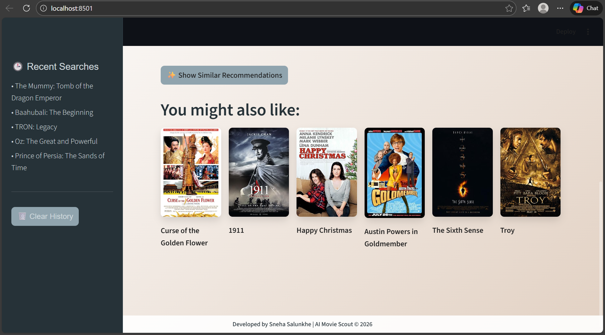

# 🎬 AI Movie Insight 
An AI-powered movie recommendation system featuring 5,000+ Hollywood and Bollywood movies.

## Features
- Content-based filtering using Cosine Similarity.
- Real-time movie data and posters via OMDb API.
- Modern Pastel UI with Matte Sidebar.
- Search history and "Show Recommendations" logic.

## How to Run
1. Clone the repo.
2. Install dependencies: `pip install -r requirements.txt`
3. Run the app: `streamlit run src/app.py`

## 🚀 Live Preview
### Home Screen

### Movie Insights & Details

### Intelligent Recommendations

---

## 🛠️ Tech Stack
- **Frontend:** Streamlit (Python-based Web Framework)
- **Machine Learning:** Scikit-learn (Cosine Similarity & CountVectorizer)
- **Data Handling:** Pandas & Pickle
- **API Integration:** OMDb API (Real-time posters and ratings)
- **Styling:** Custom CSS with Matte Grey & Pastel themes

## 📂 Project Structure
- `src/app.py`: Main application code and UI logic.
- `model/`: Pre-trained similarity matrix and movie list.
- `data/`: Raw datasets for Hollywood and Bollywood films.
- `assets/`: UI screenshots and demo images.

